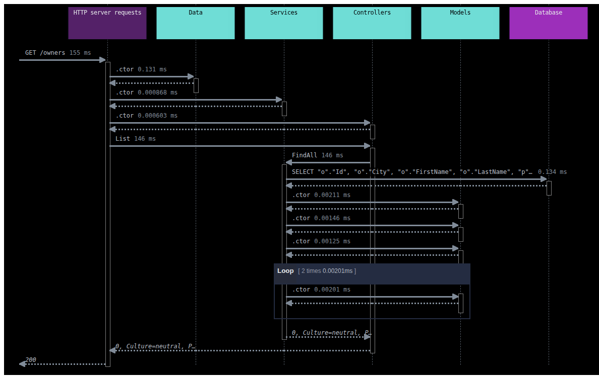

# PetClinic — ASP.NET Core sample for the AppMap .NET agent

A small [Spring PetClinic](https://github.com/spring-projects/spring-petclinic)-style
web app (ASP.NET Core MVC controllers + EF Core/SQLite) used to exercise the
agent's HTTP, application-method, and SQL recording end to end — the .NET
analog of running appmap-java against the Java PetClinic.

## Layout

| Path | Role |
|---|---|
| `Models/` | `Owner`, `Pet`, `Vet` entities |
| `Data/` | `PetClinicContext` (EF Core) + seed data |
| `Services/` | `OwnerService`, `VetService` — the instrumented application layer |
| `Controllers/` | `owners` and `vets` HTTP endpoints |
| `Program.cs` | `app.UseAppMap()` first in the pipeline |
| `appmap.yml` | records the `PetClinic` namespace |

## Run it

```sh
dotnet run --project examples/PetClinic
# then, against the running server:
curl localhost:5000/owners
curl localhost:5000/owners/Davis
curl localhost:5000/vets
curl -X POST localhost:5000/owners \
  -H 'Content-Type: application/json' \
  -d '{"firstName":"Jean","lastName":"Coleman","city":"Monona"}'
```

`UseAppMap()` writes one AppMap per request to
`tmp/appmap/request_recording/` (git-ignored). Each map captures the
`http_server_request`, the `OwnersController` → `OwnerService` calls, the
EF-issued `sql_query`, and the response.

## Render diagrams

The maps are standard AppMap 1.2 JSON, so the official
[`@appland/appmap`](https://www.npmjs.com/package/@appland/appmap) CLI (and
the AppMap VS Code extension) read them directly:

```sh
npm install -g @appland/appmap
appmap sequence-diagram -f png examples/PetClinic/tmp/appmap/request_recording/*__owners.appmap.json
```

The diagrams in this folder were generated that way:

| Diagram | Request |
|---|---|
| `get-owners.sequence.png` | `GET /owners` — controller → service → `SELECT … LEFT JOIN Pets` |
| `get-owner-by-lastname.sequence.png` | `GET /owners/{lastName}` |
| `get-vets.sequence.png` | `GET /vets` |
| `post-owners.sequence.png` | `POST /owners` — `INSERT` via `SaveChanges` |


